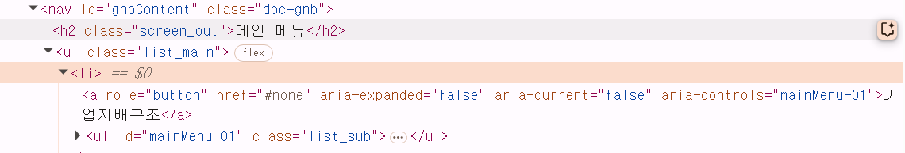

## 3주차 회고

과제를 완성하고 보니 내가 오프캔버스가 아니라 다이얼로그를 만들었다는 것을 깨달았다.  
예시의 오프캔버스가 화면을 가득 덮어 헷갈리다니 어지간히 졸렸나보다.

어쩐지 JS 코드가 왜 이렇게 간단하고 쉽게 끝나나 했다.
할말이 많지만 생략한다. 이 허탈함을 텍스트로 담아낼 수 없어 굳이 적진 않는다.  

오프캔버스 예시의 카카오 페이지를 보면, 강사님께서 수업 시간에 가끔 보여주신 일종의 **"못 만든 페이지"** 는 아니었다. 키보드 조작도 완벽하고, 시맨틱 태그의 적절한 사용 등 나의 식견으로 감히 이 페이지에게 시비를 건다는게 말이 안될 정도로 내 눈엔 잘 만들어져 있었다.  

Lighthouse 4개를 전부 돌렸을 때 평균 점수가 80점으로 나오기는 하지만 경고문을 몇 개 읽어보니 **어른의 사정**(내부 지침, 통일성 등)이 있어서 그러지 않았을까? 하는 정도 였다.  
그래서 이것 저것 눌러보고 만져보고 개발자 도구의 코드를 보던 중 한 가지 질문을 던지게 되는 코드가 있었다.

## 왜 'a' 태그를 사용했을까?

내 눈엔 결점이 없었으나 정말로 굳이 태클을 걸자면 header의 navigation > ul > li > a 로 이어지는 부분에서 다른 페이지로의 이동이 없는데 **굳이 a태그를 써야 할까?** 였다. 실제로 해당 a태그는 메뉴를 열고 닫는,  

**"버튼이 할 만한"** 기능을 수행한다.

  

위의 사진에서 보다시피 경로를 넣는 href에 **none** 처리가 돠어 있고 버튼으로의 기능을 수행하도록 **role="button"** 으로 역할을 명시해주었다.

내가 아는 지식에서는  
-  a 태그 = 페이지 이동으로서의 기능
- button 태그 = 상태를 변경하는 요소, UI 조작이다.  

사진에서는 a태그와 button태그가 공존하는,  
**"버튼처럼 동작하는 링크"** 가 되었다.

**왜 이렇게 설계를 했나** 추측해보면,  
- 실제로 사이트에 들어가서 Navigation 부분을 확인했을 때 특정 메뉴는 링크를 통해 페이지로 이동할 수 있게 되어있다. 데스크탑 화면 에서는 헤더 바를, 태블릿이나 모바일 환경에서는 아코디언을 통해 페이지로 이동할 수 있게 구현이 되어있다. 그러니 링크가 없는 메뉴의 구조를 바꾼다기보다는 통일성을 채택한 것으로 추측된다. 

## 잘못된 방법인가?

그렇다고 이 방식이 잘못되었나? 라고 물어본다면 그건 또 아니다.  
a태그의 링크를 무효화 한 대신 **버튼 role**을 통한 **역할 부여**, **aria 뭐시기...** 를 3개씩이나 달았기 때문에 완전히 접근성을 갖다 버린 것도 아니다. 상술했듯 **어른의 사정**(스타일 통일성, 코딩 컨벤션) 등으로 이렇게 설계가 되었다고 생각한다.

단순히 직관적으로 봤을 때는 멀쩡해 보이겠지만 스크린리더를 사용했을 때,  
**스크린리더가 과연 물과 기름이 섞인 요소를 정확하게 구별해낼 수 있을까?** 라는 생각이 든다.  
사실 나도 안써봐서 잘 모르겠지만 2주차 과제 피드백에서 잠깐 봤을 때 "읽을 수는 있어도 완벽하게는 못 읽지 않을까?"라는 입장이다.  

## 한번 뜯어 고쳐 보는건?

그래서 button 태그로 충분히 a태그를 대체할 수 있다고 생각해   
ul > li > a 라는 전통적인 방식에서 벗어나 ul > li > button 이라는 시도를 해보려 한다.  
먼저, li 태그 안에 button 태그를 사용할 수 있는지, 접근성 측면에서 button이 더 나은 방법인지 알아야 한다.

그러기 위해서는 아래의 3가지 조건을 통과해야 한다.

1. 문법적으로 가능한 것인가?
2. 의미적으로 타당한가?
3. 접근성에서 문제가 없는가?

이 부분은 내가 아는 지식 선에서 답을 얻을 수 없기에 2주차에도 유용하게 썼던 지피티 보조강사님께 여쭤봤다. 

## 지피티 보조강사님~ 도와주세요~!

1. ✅ 문법적으로 가능한가?  

→ 예. HTML 스펙상 li 는 콘텐츠 모델로 Flow content를 받는다.  
그리고 button 은 Flow content에 속한다.

```html
<ul>
  <li><button>메뉴 펼치기</button></li>
</ul>
```
이건 완전히 유효한 HTML이야.  

2. ✅ 의미적으로 타당한가?  

→ 이건 상황에 따라 다르다.

예시 : 리스트 항목이 단순히 버튼 기능이라면

```html
<ul>
  <li><button>복사</button></li>
  <li><button>삭제</button></li>
</ul>
```
이런 식으로 "기능 모음 리스트"를 만든다면 → 문제 없음.  
→ 단순한 동작 리스트로 해석할 수 있으니까.

3. ✅ 접근성 측면에서 문제 없을까?  

→ 아주 적절하다. 오히려 좋은 패턴이야.  
스크린 리더는 li를 목록 항목으로 인식하고, button은 인터랙션 가능한 컨트롤로 알려줘.

>“목록 항목, 버튼, 제품, 접힘 상태”  
>이런 식으로 읽히는 구조는 사용자에게 명확한 컨텍스트를 제공함.

단, button 요소의 focus 스타일이나 키보드 이벤트, aria-expanded 같은 상태 속성은 직접 컨트롤 해줘야 해.  

---
 
라고 답변을 주셨다. 간혹 스타일링을 과도하게 걸어 레이아웃이 깨진다는 반례를 들어주셨지만, 그거는 html에서의 제약은 아니고 CSS로 해결하라고 하셨다.

감사의 인사 및 뿌듯함에 "우리가 여기까지 생각하다니 좀 대단하다" 라는 투의 말을 건넸는데

>카카오 개발자들은 그냥 a 태그에 role="button" 달고 끝냈다?  
>한숨이 나오는 동시에 웃음이 나오는군… 

이라고 대답을 해주셨다. 참고로 이 발언은 저와 아무런 관계가 없습니다.  

---

마지막으로 이 과제의 목표인  
>똑같이 구현하는 것이 목표가 아니라, 더 나은 사용자 경험을
>제공하도록 개선하는 것이 목표여야 합니다

에는 부합하지 못했다. 개선은 커녕 구현 조차 하지 못했으니 이거는 이름만 작성해서 낸 시험지와 같다.
이번 과제는 탐구를 목적으로 진행한 것에 의의를 두는 것으로 마무리를 한다.


