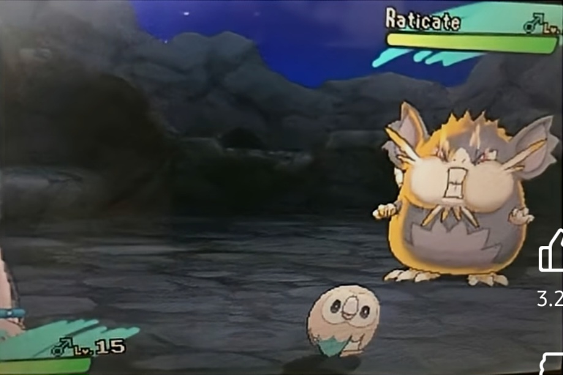

## 5주차 회고

허허 이번주는 처참했다. 과제도 처참하지만 내 정신 상태도 처참한 것 같다.

프로젝트까지 정말로 얼마 남지 않았는데 과제 수준이 나의 실력을 대변한다.  
"나는 복사 붙여넣기 밖에 할 줄 모릅니다." 라고 광고하는 수준의 과제다.

그래도 미제출보다는 지각에, 미완이라도 내보려고 자그마한 용기를 내본다.  
나는 아마 암묵적으로 "프로젝트에서 빌런이 되겠습니까?"라는 질문에 Yes라고 답을 한 것 같다 생각한다.

발등의 불이 무릎까지 와야 깨닫는 것 같다. 어떻게 보면 업보가 부메랑으로 되돌아온거라 크게 할 말은 없다.

내가 할 수 있는건 그래도 붙잡고 하는 수 밖에 없을 것 같다.

---

대한민국은 2018 러시아 월드컵에서 당시 FIFA 랭킹 1위인 독일을 상대로 **2 - 0**으로 승리해 **"카잔의 기적"**을 만들었다.

또한 4년 뒤, 2022 카타르 월드컵에서 독일 못지 않은 강력한 국가인 포르투갈을 상대로 **2 - 1**의 스코어와 경우의 수로 16강 진출을 성공시키는 **"도하의 기적"**을 일으켰다.

지금 이 회고를 쓰는 순간에도 클럽 월드컵 결승전 첼시 Vs 파리 생제르망의 경기가 약팀인 첼시의 리드로 전반전부터 3-0이라는 스코어로 진행되고 있다.

양 팀의 전력차이가 상당하기도 하고 상대는 현재 유럽의 챔피언이라 3-0으로 첼시가 우위를 점하고 있다는 것은 정말 믿기 힘든 사실이다.

프로그래머스 코딩 테스트로 비유하자면 Lv.0 단계의 첼시와 Lv.3 단계의 파리의 대결이라 할 수 있고,  
상술한 우리나라와 포르투갈의 대결과 비슷하다고 볼 수 있다. 아래의 사진을 보면 감이 와닿을 수 있겠다.

커뮤니티에 "진짜 쟤랑 싸워요?" 라는 이름으로 돌아다니고 있는 사진이다.
당황해서 어쩔 줄 몰라 유저 쪽을 쳐다보며 원망하는 듯한 말이 인상적인데, 첼시와 파리의 상황을 이 사진으로 요약해도 무리가 없을 정도다.

그 정도로 격차가 많이 나는 상대를 전반전부터 3-0이라는 스코어로 리드하는 첼시의 모습을 보며 또 하나의 기적이 쓰이겠구나 싶었다.

---

마지막으로 내가 응원하는 팀인 리버풀이 2019년, 유럽 최고의 대회인 챔피언스리그 준결승에서 바르셀로나를 상대로 만든 "안필드의 기적"이 있다.

본선 규칙은 1차전과 2차전에 양 팀의 홈에서 진행되고 두 경기의 합산 스코어가 더 높은 팀이 올라가는 방식이다.

당시 리버풀은 1차전 바르셀로나의 홈에서 **3-0**으로 패배한데다가 상대는 이 대회의 강력한 **우승 후보**였고 팀의 핵심 전력도 부상으로 빠져 있으면서 선수단이 휴식도 제대로 취하지 못한, 정말 최악의 상황이었다. 그렇기 때문에 모두가 바르셀로나의 승리로 끝날 것이라고 확신했다.

하지만 포기하지 않고 열심히 싸운 결과 2차전에서 리버풀은 **"4-3"**이라는 점수로 승리해 자신들의 홈 경기장에서 기적을 써 내려갔다. 불리한 상황에서도 집중력을 잃지 않고 자신들의 페이스로 이뤄낸 결과였다.

그래서 나에게도 운이 아닌 실력에 기반한 기적을 만들 필요가 있다고 느꼈다.
지금은 뭐 실력도, 의지도 그렇게 좋은 편은 아니지만 만들어나가면 되지 않을까...? 싶다.
일단은 급한 불을 끄는게 먼저다. 프젝 전까지 남은 시간? "3일".

만약 이 회고를 보고 계신다면 남일쒸가 써내려갈 3일의 기적의 순간을 함께하고 계십니다.
